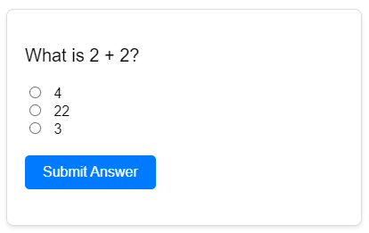

# 📝 Interactive Quiz Application  



## 🚀 Overview  

A lightweight, interactive quiz application built with vanilla JavaScript that demonstrates core web development principles.

## ✨ Features

- Single-question quiz with multiple-choice answers  
- Instant feedback system with color-coded responses  
- Input validation to ensure answer selection  
- Clean UI with responsive design  
- Zero dependencies (pure HTML/CSS/JS)  

## 🛠️ Technologies  

- **Frontend**: HTML5, CSS3, JavaScript (ES6)  
- **Version Control**: Git  
- **Compatibility**: Works on all modern browsers  

## 🏗️ Project Structure  

quiz-app/
├── index.html # Main HTML structure
├── quiz.js # All interactive logic
├── style.css # Styling and layout
└── README.md # Documentation

## 🎯 How It Works  

1. User selects an answer  
2. Clicks "Submit Answer"  
3. System validates:  
   - ✅ Correct → Green success  
   - ❌ Incorrect → Red error  
   - ⚠️ No selection → Orange warning  

## 🛠️ Development  

```bash
git clone https://github.com/babasalieu360/ALX_Simple_Quiz.git
